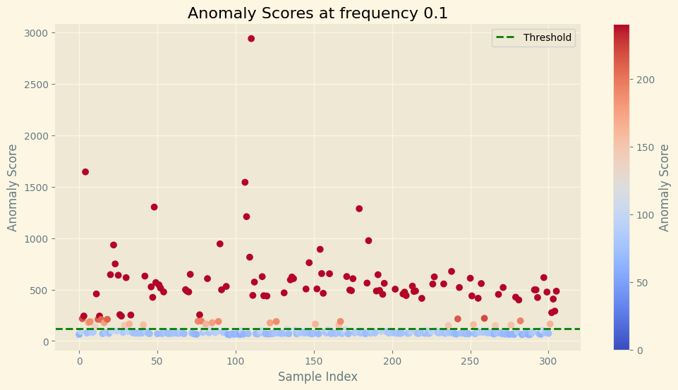

# Timeseries Anomaly Detection
*Machine Learning in Applications - FP01 - 2024/14*
## Evaluating State-of-the-Art Models for Unsupervised Collision Detection in Industrial Robot Time Series

## Authors:
- Mustich Federico
- Tcaciuc Claudiu Constantin
- Tomatis Gabriele

## Project Overview
This project explores the application of state-of-the-art (SOTA) machine learning models for unsupervised anomaly detection (TAD) in multivariate time series data. The focus is on detecting collisions in industrial robots based on sensor data. Various models, including deep learning architectures (LSTM-based, Autoencoder), tree-based models (Random Forest, Isolation Forest), and an ad-hoc Bayesian model, are evaluated and compared.

## Dataset
The dataset consists of time-series recordings from KUKA industrial robots. It includes normal recordings with no anomalies and two datasets containing collisions, which act as anomalies. Data preprocessing and analysis are performed using Python, with libraries like numpy, pandas, and matplotlib.

## Models Evaluated
## Bayesian Model
Developed in-house, utilizing a multi-layer perceptron (MLP) with dropout, this model focuses on predicting actions, with anomaly detection based on prediction confidence.

## Autoencoder
Unsupervised learning model trained to reconstruct input data, with anomalies identified based on reconstruction error exceeding a threshold.

## Isolation Forest
Tree-based model designed for outlier detection, isolating anomalies based on the length of decision paths.

## LSTM-AD (Anomaly Detection)
Long Short-Term Memory (LSTM) model trained on normal sequences, detecting anomalies based on prediction errors.

## LSTM-ED (Encoder-Decoder)
LSTM-based model that learns to encode and decode time series, identifying anomalies when reconstruction error exceeds a threshold.

## Random Forest
A decision-tree-based ensemble model used to classify actions, with anomalies flagged based on classification confidence.

## RNN-EBM (Energy-Based Recurrent Neural Network)
Combines recurrent neural networks with energy-based models for sequence modeling and anomaly detection.

## DAGMM (Deep Autoencoding Gaussian Mixture Model)
A combination of autoencoders and Gaussian Mixture Models (GMMs) used for anomaly detection in reduced feature spaces.

## Evaluation Metrics
- F1 Score
- Accuracy
- Precision
- Recall
- AUC-ROC
- AUC-PR
The models are tested on different sampling frequencies (1Hz, 10Hz, 100Hz, 200Hz), with thresholds based on statistical techniques like Median Absolute Deviation (MAD), Standard Deviation (STD), and others.

## Key Results
**LSTM-ED**: Achieved the highest overall performance, particularly at 200Hz with an F1 score of 0.94.
**Autoencoder**: Performed well across multiple frequencies, especially at 100Hz with a 0.93 F1 score.
**Random Forest & Bayesian Models**: Showed good performance when trained on high-frequency data but struggled with lower frequency datasets.
**DAGMM**: Failed to perform well on the task due to high feature dimensionality.

## Conclusions
The LSTM-ED model stands out as the best-performing model for this task, demonstrating its ability to effectively capture the temporal patterns required for anomaly detection. The importance of selecting an appropriate threshold for anomaly detection was also highlighted, with MAD proving to be a reliable choice. The Bayesian model showed promise but requires further tuning for low-frequency data.

## How to run the code
Clone the repository and create a virtual environment, then install libraries from the `requirements.txt` file.

The Dataset folder must be placed in the root of the project. as `.\dataset\`

Each notebook is self-contained and can be run independently. The notebooks are organized as follows:
- data preprocessing
- model training
- model evaluation

for each model to select the frequency of the data to use, you can change the variables `freq` inside the 3rd cell of each notebook.

## Future Work
Future developments can focus on improving action-based anomaly detection approaches like the Bayesian model and exploring further optimization of deep learning models such as LSTM-ED for real-time applications in industrial robotics.

## Paper
[Machine Learning in Applications FP01 - 2024/14 Project Report](Paper_FP01_2024_14.pdf)

## Training Environment
- CPU: Ryzen 7 5800X 8-core 16-thread 3.8GHz
- GPU: NVIDIA RTX 3060 12GB
- RAM: 32GB DDR4 3200MHz
- OS: Windows 11
- Python 3.11.2
